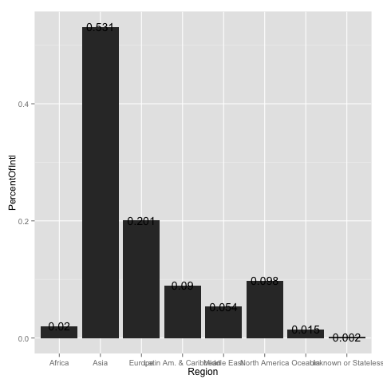
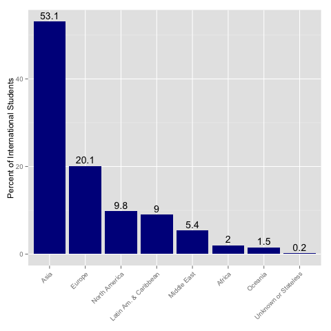
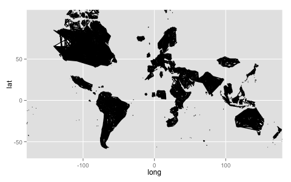
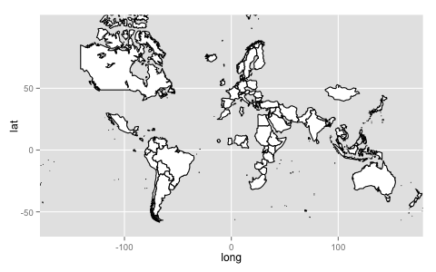
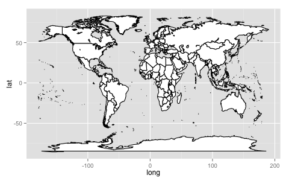
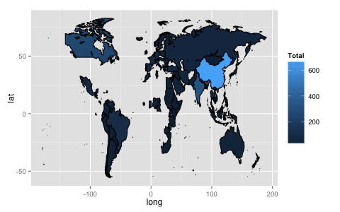
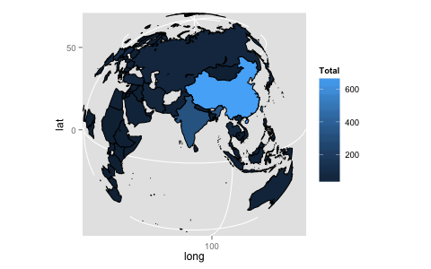

<h1>Origins of MIT International Students</h1>

<h2>Objective</h2>
Visualize the origins of the MIT international students and outline some of the challenges of putting together a world map.

<h2>About the Data</h2>
The data was provided by <a href='http://web.mit.edu/iso/ target='_blank'>MIT International Student Office</a>, through the Analytics Edge course taught by MIT via <a href='https://www.edx.org/' target='_blank'>EdX</a>.

<h2>Visualization Process</h2>
<h4>Bar Plot</h4>
<h6>Load up the data</h6>
    > intl <- read.csv("data/intl.csv")
    > intl
		     Region PercentOfIntl
    1                  Asia         0.531
    2                Europe         0.201
    3         North America         0.098
    4 Latin Am. & Caribbean         0.090
    5           Middle East         0.054
    6                Africa         0.020
    7               Oceania         0.015
    8  Unknown or Stateless         0.002

<h6>Make a bar plot</h6>

It's an ugly plot. We will pretty it up a bit soon.

    ggplot(intl, aes(x=Region, y=PercentOfIntl)) +
      geom_bar(stat="identity") +
      geom_text(aes(label=PercentOfIntl))

<h6>Make Region an ordered factor</h6>

We want to order the continents in the bar plot by the percentage of international students coming to MIT.

The following command re-orders the rows in the data frame but does NOT create Region an ordered factor:

    > intl <- intl[order(- intl$PercentOfIntl), ]  
    > intl
		     Region PercentOfIntl
    1                  Asia         0.531
    2                Europe         0.201
    3         North America         0.098
    4 Latin Am. & Caribbean         0.090
    5           Middle East         0.054
    6                Africa         0.020
    7               Oceania         0.015
    8  Unknown or Stateless         0.002

Instead, we can use the below command to reorder the factor.

    > intl <- transform(intl, Region = reorder(Region, -PercentOfIntl))

<h6>Final bar plot output</h6>

    > intl$PercentOfIntl = intl$PercentOfIntl * 100  # createpercentage values out of 100
    >
    > ggplot(intl, aes(x=Region, y=PercentOfIntl)) +
    +   geom_bar(stat="identity", fill="dark blue") +
    +   geom_text(aes(label=PercentOfIntl), vjust=-0.4) +
    +   ylab("Percent of International Students") +
    +   theme(axis.title.x = element_blank(), 
    +         axis.text.x = element_text(angle = 45, hjust = 1))

<h4>World Map</h4>

<h6>Load the MIT international students data</h6>

    > intlall <- read.csv("data/intlall.csv", stringsAsFactors=FALSE)

<h6>View the first few rows</h6>

    > head(intlall)
	      Citizenship UG  G SpecialUG SpecialG ExhangeVisiting Total
    1             Albania  3  1         0        0               0     4
    2 Antigua and Barbuda NA NA        NA        1              NA     1
    3           Argentina NA 19        NA       NA              NA    19
    4             Armenia  3  2        NA       NA              NA     5
    5           Australia  6 32        NA       NA               1    39
    6             Austria NA 11        NA       NA               5    16

There are missing values here but they should really be zeros. We will replace the NAs soon.

    > head(is.na(intlall))
	 Citizenship    UG     G SpecialUG SpecialG ExhangeVisiting Total
    [1,]       FALSE FALSE FALSE     FALSE    FALSE           FALSE FALSE
    [2,]       FALSE  TRUE  TRUE      TRUE    FALSE            TRUE FALSE
    [3,]       FALSE  TRUE FALSE      TRUE     TRUE            TRUE FALSE
    [4,]       FALSE FALSE FALSE      TRUE     TRUE            TRUE FALSE
    [5,]       FALSE FALSE FALSE      TRUE     TRUE           FALSE FALSE
    [6,]       FALSE  TRUE FALSE      TRUE     TRUE           FALSE FALSE

We want to make sure that the Citizenship column does not have any missing values or that any missing values in the column do not get replaced by 0. 

    > unique(is.na(intlall$Citizenship))
    [1] FALSE

<h6>Replace the NAs with 0</h6>

    > intlall[is.na(intlall)] = 0
    > head(intlall)
	      Citizenship UG  G SpecialUG SpecialG ExhangeVisiting Total
    1             Albania  3  1         0        0               0     4
    2 Antigua and Barbuda  0  0         0        1               0     1
    3           Argentina  0 19         0        0               0    19
    4             Armenia  3  2         0        0               0     5
    5           Australia  6 32         0        0               1    39
    6             Austria  0 11         0        0               5    16

<h6>Load the world map</h6>

    > world_map <- map_data('world')
    > head(world_map)
	   long      lat group order region subregion
    1 -133.3664 58.42416     1     1 Canada      <NA>
    2 -132.2681 57.16308     1     2 Canada      <NA>
    3 -132.0498 56.98610     1     3 Canada      <NA>
    4 -131.8797 56.74001     1     4 Canada      <NA>
    5 -130.2492 56.09945     1     5 Canada      <NA>
    6 -130.0131 55.91169     1     6 Canada      <NA>

<h6>Merge intlall and world_map data frames</h6>

    > mapIntlMIT = merge(world_map, intlall, by.x ="region", by.y = "Citizenship")
    > head(mapIntlMIT)
       region     long      lat group order subregion UG G SpecialUG SpecialG ExhangeVisiting Total
    1 Albania 20.00975 39.69194    80  8481      <NA>  3 1         0        0               0     4
    2 Albania 21.01053 40.72194    80  8485      <NA>  3 1         0        0               0     4
    3 Albania 20.51831 41.23388    80  8487      <NA>  3 1         0        0               0     4
    4 Albania 20.71082 40.26501    80  8484      <NA>  3 1         0        0               0     4
    5 Albania 19.54308 41.57388    80  8496      <NA>  3 1         0        0               0     4
    6 Albania 20.31834 39.98443    80  8483      <NA>  3 1         0        0               0     4

<h6>Plot the map</h6>

    > ggplot(mapIntlMIT, aes(x=long, y=lat, group=group)) +
    +   geom_polygon(fill="white", color="black") +
    +   coord_map("mercator")

We see that a lot of the countries look like blobs. What happened is that during the merge process, the order of data frame rows were changed. We will to re-order the rows before creating a world map.

<h6>Re-order the merged data frame</h6>

    > mapIntlMIT <- mapIntlMIT[order(mapIntlMIT$group, mapIntlMIT$order), ]

<h6>Re-plot</h6>

Ah, looks much better. However, there is no Russia or China. They are two of the biggest countries in the world! What happened?

<h6>Looking for China</h6>

Looking for China in the intlall data set:

    > grep('China', intlall$Citizenship)
    [1] 19
    > intlall$Citizenship[19]
    [1] "China (People's Republic Of)"

Looking for China in the world_map data set:

    > grep('China', unique(world_map$region))
    [1] 48
    > unique(world_map$region)[48]
    [1] "China"

Because intlall and world_map data sets used diifferent names, China was dropped during the merge process. Russia was probably dropped because of the same reason. Let's look for Russia.

<h6>Looking for Russia</h6>

Looking for Russia in the intall data set:

    > grep('Russia', intlall$Citizenship)
    [1] 81
    > intlall$Citizenship[81]
    [1] "Russia"

Looking for Russia in the world_map data set:

    > grep('Russia', unique(world_map$region))
    integer(0)

There is row that contains the text 'Russia' in the world_map data. We can manually go through the list of all country names in the world_map data set.

    > sort(unique(world_map$region))
      [1] "Afghanistan"              "Albania"                  "Algeria"                 
      [4] "American Samoa"           "Andaman Islands"          "Andorra"                 
      [7] "Angola"                   "Anguilla"                 "Antarctica"              
     [10] "Antigua"                  "Aral Sea"                 "Argentina"               
     [13] "Aruba"                    "Australia"                "Austria"                 
     [16] "Azores"                   "Bahamas"                  "Bahrain"                 
     [19] "Bangladesh"               "Barbados"                 "Barbuda"                 
     [22] "Belgium"                  "Belize"                   "Benin"                   
     [25] "Bhutan"                   "Black Sea"                "Bolivia"                 
     [28] "Bonaire"                  "Botswana"                 "Brazil"                  
     [31] "Brunei"                   "Bulgaria"                 "Burkina Faso"            
     [34] "Burundi"                  "California"               "Cambodia"                
     [37] "Cameroon"                 "Canada"                   "Canary Islands"          
     [40] "Cape Verde"               "Caspian Sea"              "Cayman Islands"          
     [43] "Central African Republic" "Chad"                     "Chagos Archipelago"      
     [46] "Chile"                    "China"                    "Colombia"                
     [49] "Comoros"                  "Congo"                    "Cook Islands"            
     [52] "Costa Rica"               "Cuba"                     "Curacao"                 
     [55] "Cyprus"                   "Czechoslovakia"           "Denmark"                 
     [58] "Djibouti"                 "Dominica"                 "Dominican Republic"      
     [61] "Ecuador"                  "Egypt"                    "El Salvador"             
     [64] "Equatorial Guinea"        "Ethiopia"                 "Falkland Islands"        
     [67] "Fiji"                     "Finland"                  "France"                  
     [70] "French Guiana"            "French Polynesia"         "Gabon"                   
     [73] "Gambia"                   "Gaza Strip"               "Germany"                 
     [76] "Ghana"                    "Great Bitter Lake"        "Great Lakes"             
     [79] "Greece"                   "Greenland"                "Grenada"                 
     [82] "Guadeloupe"               "Guatemala"                "Guinea"                  
     [85] "Guinea-Bissau"            "Guyana"                   "Haiti"                   
     [88] "Hawaii"                   "Honduras"                 "Hungary"                 
     [91] "Iceland"                  "India"                    "Indonesia"               
     [94] "Iran"                     "Iraq"                     "Ireland"                 
     [97] "Irian Jaya"               "Isle of Man"              "Isle of Wight"           
    [100] "Israel"                   "Italy"                    "Ivory Coast"             
    [103] "Jamaica"                  "Japan"                    "Jordan"                  
    [106] "Kenya"                    "Kiribati"                 "Kuwait"                  
    [109] "Lacul Greaca"             "Lake Albert"              "Lake Fjerritslev"        
    [112] "Lake Kariba"              "Lake Malawi"              "Lake Pasvikelv"          
    [115] "Lake Tanganyika"          "Lake Titicaca"            "Lake Victoria"           
    [118] "Laos"                     "Lebanon"                  "Lesotho"                 
    [121] "Liberia"                  "Libya"                    "Liechtenstein"           
    [124] "Luxembourg"               "Madagascar"               "Madeira Islands"         
    [127] "Malawi"                   "Malaysia"                 "Maldives"                
    [130] "Mali"                     "Malta"                    "Marshall Islands"        
    [133] "Martinique"               "Maug Island"              "Mauritania"              
    [136] "Mauritius"                "Mexico"                   "Micronesia"              
    [139] "Monaco"                   "Mongolia"                 "Montserrat"              
    [142] "Morocco"                  "Mozambique"               "Myanmar"                 
    [145] "Namibia"                  "Nauru"                    "Nepal"                   
    [148] "Netherlands"              "Neutral Zone"             "Nevis"                   
    [151] "New Caledonia"            "New Zealand"              "Nicaragua"               
    [154] "Niger"                    "Nigeria"                  "North Korea"             
    [157] "Northern Mariana Islands" "Norway"                   "Oman"                    
    [160] "Pakistan"                 "Panama"                   "Papua New Guinea"        
    [163] "Paracel Islands"          "Paraguay"                 "Peru"                    
    [166] "Philippines"              "Pitcairn Islands"         "Poland"                  
    [169] "Portugal"                 "Puerto Rico"              "Qatar"                   
    [172] "Romania"                  "Rwanda"                   "Saint Eustatius"         
    [175] "Saint Kitts"              "Saint Lucia"              "Saint Vincent"           
    [178] "Saint-Barthelemy"         "Saint-Martin"             "Samoa"                   
    [181] "San Marino"               "Sao Tome and Principe"    "Sardinia"                
    [184] "Saudi Arabia"             "Senegal"                  "Seychelles"              
    [187] "Sicily"                   "Sierra Leone"             "Sin Cowe Island"         
    [190] "Solomon Islands"          "Somalia"                  "Sonsorol Island"         
    [193] "South Africa"             "South Korea"              "South Sandwich Islands"  
    [196] "Spain"                    "Spratly Island"           "Sri Lanka"               
    [199] "Sudan"                    "Suriname"                 "Swaziland"               
    [202] "Sweden"                   "Switzerland"              "Syria"                   
    [205] "Tanzania"                 "Thailand"                 "Tobago"                  
    [208] "Togo"                     "Tokelau"                  "Tonga"                   
    [211] "Trinidad"                 "Tunisia"                  "Turkey"                  
    [214] "Turks and Caicos"         "Tuvalu"                   "Uganda"                  
    [217] "UK"                       "United Arab Emirates"     "Uruguay"                 
    [220] "USA"                      "USSR"                     "Vanuatu"                 
    [223] "Venezuela"                "Vietnam"                  "Virgin Islands"          
    [226] "Vislinskiy Zaliv"         "Wales"                    "West Bank"               
    [229] "Western Sahara"           "Yemen"                    "Yugoslavia"              
    [232] "Zaire"                    "Zambia"                   "Zimbabwe"      
Hope you didn't actually go through the names, trying to find it. We can do better than that!

<h6>Plot the world map</h6>

    > ggplot(world_map, aes(x = long, y = lat)) + 
    +   geom_polygon(color = 'black', fill = 'white')

We can see that a part of Russia's border stretched where the longitude is greater than 150 and latitude is greater than 50.

<h6>Find Russia was named in the world_map</h6>

    > head(subset(world_map, long > 150 & lat > 50))
	     long      lat group order region subregion
    1678 150.5055 59.51805     5  1678   USSR      <NA>
    1679 151.5533 59.49084     5  1679   USSR      <NA>
    1680 152.0333 59.27638     5  1680   USSR      <NA>
    1681 152.1522 59.19777     5  1681   USSR      <NA>
    1682 151.1825 59.01918     5  1682   USSR      <NA>
    1683 151.5400 58.85915     5  1683   USSR      <NA>

We can see that Russia was labeled "USSR" in the world_map data frame.

<h6>Fix by renaming the names in the intlall data set</h6>

    > intlall$Citizenship[intlall$Citizenship=="China (People's Republic Of)"] = "China"
    > intlall$Citizenship[intlall$Citizenship=='Russia'] = 'USSR'

<h6>Re-merge and re-order the rows</h6>

    > mapIntlMIT <- merge(world_map, intlall, 
    +                    by.x ="region",
    +                    by.y = "Citizenship")
    > mapIntlMIT <- mapIntlMIT[order(mapIntlMIT$group, mapIntlMIT$order), ]

<h6>Replot</h6>

    > ggplot(mapIntlMIT, aes(x=long, y=lat, group=group)) +
    +   geom_polygon(aes(fill=Total), color="black")

<h6>Try another projection</h6>

    > ggplot(mapIntlMIT, aes(x=long, y=lat, group=group)) +
    +   geom_polygon(aes(fill=Total), color="black") +
    +   coord_map("ortho", orientation=c(20, 80, 0))

<h2>Final Words</h2>
We were able to spot China and Russia missing from the output map but one can imagine how many other countries had different names used in the two data sets we used, world_map and intlall. I hope this walk-through gives you more appreciation for data pre-processing.